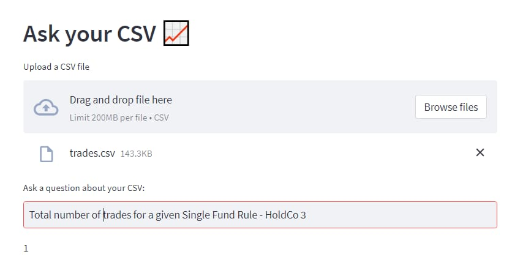
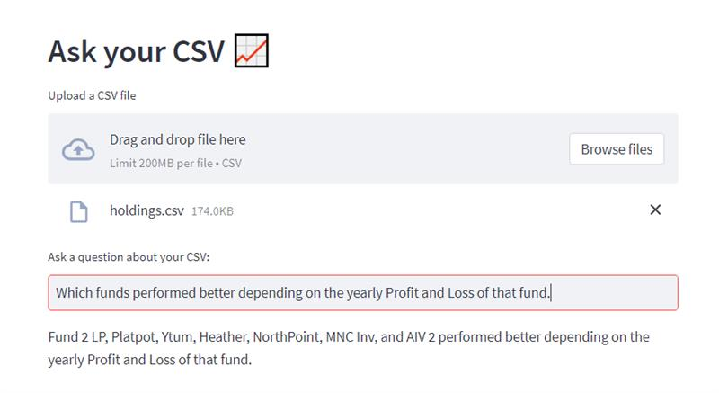
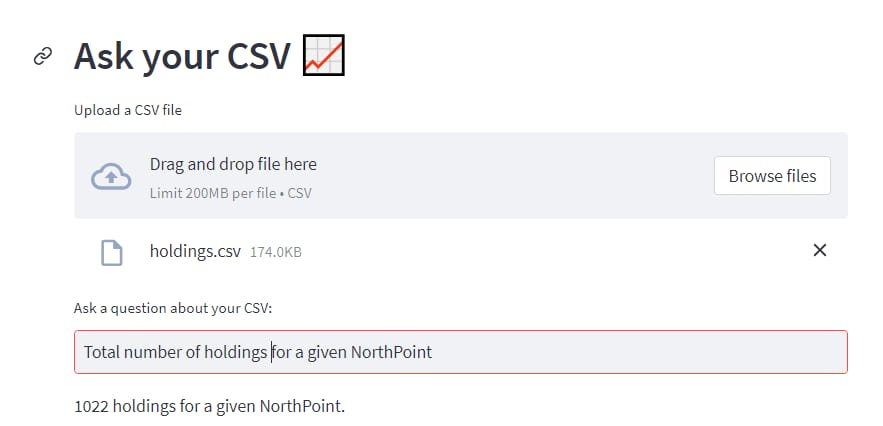
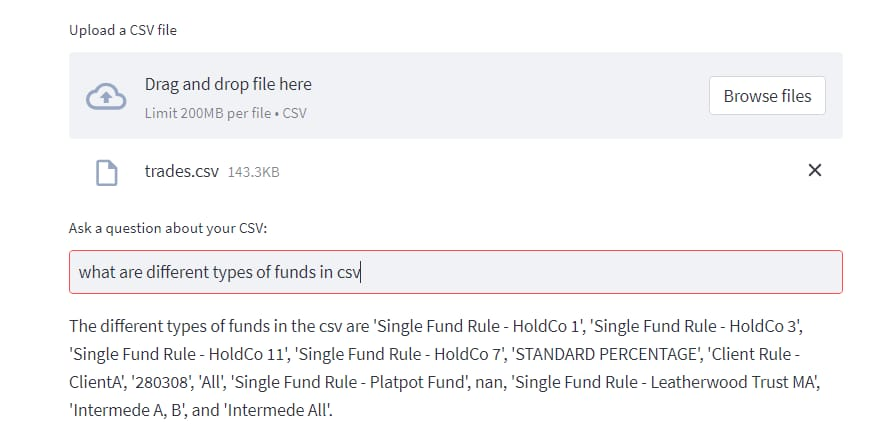
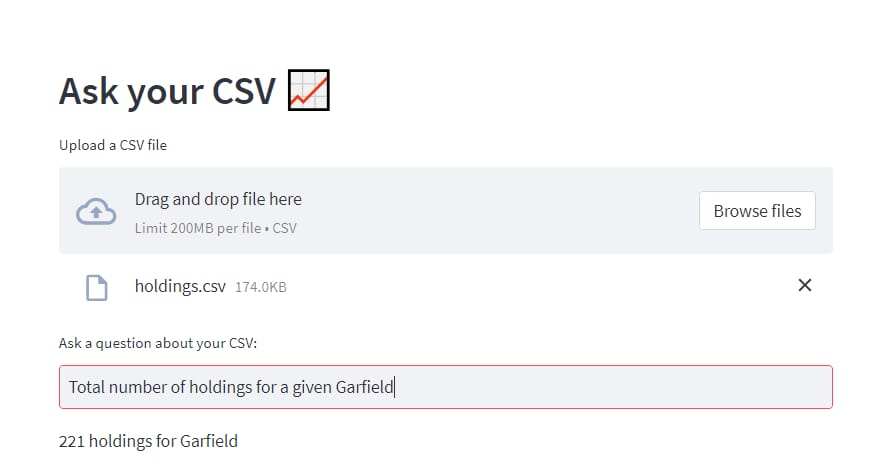

# ChatBot for CSV Files with OpenAI 

This Python application allows users to interact with a CSV file using natural language. It harnesses Language Models (LLMs) to generate responses based on the CSV data, ensuring that answers are relevant to the information contained within the CSV.

## How it works

The application processes data from a CSV file using OpenAI LLMs and Langchain Agents to respond to user questions. The CSV agent employs various tools to find solutions to your queries and generates relevant responses with the assistance of an LLM.

Furthermore, the application utilizes Streamlit to build a user-friendly graphical interface (GUI) and relies on Langchain for seamless interaction with the LLM.

## Installation

To install the repository, follow these steps:

1. Clone this repository to your local machine.
2. Install the necessary dependencies by running the following command:

   ```
   pip install -r requirements.txt
   ```

3. Additionally, you need to obtain an OpenAI API key and add it to the `.env` file.

## Deploy
### Step 1: build the docker image

   ```
   docker build chatbot:v1 . 
   ```
## Or you can pull base image directly from my dockerhub account

   ```
   docker pull rahulsarojsingh/chatbot-app:latest
   ```

### Step 2: Deploy the ChatBot
if you build image please run this cmd:

   ```
   Docker run chatbot:v1 
   ```
if you pull the image please run this cmd:

   ```
   Docker run rahulsarojsingh/chatbot-app:latest
   ```

## OPENAI_API_KEY

To use the application, Please give the OPENAI_API_KEY in the `.env` file.

## Usage

To use the application, execute the `main.py` file using the Streamlit CLI. Make sure you have Streamlit installed before running the application. Run the following command in your terminal:

```
streamlit run main.py
```
Some Q&A seasion :

```
holdings.csv
First test
1.Total number of holdings for a given Garfield?
ans. 221 holdings for Garfield
2. name of the funds in csv?
ans. The funds in the csv are Garfield, Heather, MNC Inv, NorthPoint, AIV 1, Opium, Ytum, Platpot, Hi Yield, Lee Investment, SMA-L1, SMA-L2, SMA-L4, IG Corp, Fund 2 LP, AIV 2, NPSMF3, NPSMF1, and NPSMF2.
3. Total number of rows for PortfolioName SMA-L1
3
4. Total number of rows for PortfolioName Heather
195
Now second test
1. Which  PortfolioName performed better depending on the yearly Profit and Loss of that fund.
Ytum performed the best based on the yearly Profit and Loss of that fund.
2. Which  PortfolioName performed better depending on the yearly Profit.
Ytum performed better with a yearly Profit of 7.229903e+06.
trades.csv
1.Total number of PortfolioName for a given Garfield?
The total number of PortfolioName for a given Garfield is 1.
2.what are the different funds  in csv?
The different funds in the csv are 'Single Fund Rule - HoldCo 1', 'Single Fund Rule - HoldCo 3', 'Single Fund Rule - HoldCo 11', 'Single Fund Rule - HoldCo 7', 'STANDARD PERCENTAGE', 'Client Rule - ClientA', '280308', 'All', 'Single Fund Rule - Platpot Fund', nan, 'Single Fund Rule - Leatherwood Trust MA', 'Intermede A, B', and 'Intermede All'.

```









